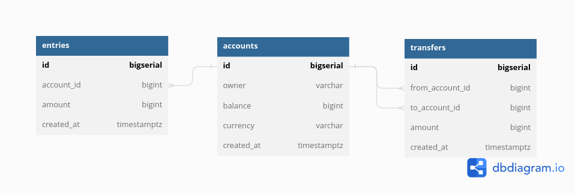

# bank
## Database
For my Database i am using Postgres. 
### Databasediagram
I've created my Databasediagramm with dbdiagram.io. From this website i also exported my Postgres code. 

https://dbdiagram.io/d/648ad1f6722eb7749401ae61
**Live Version of my Diagramm:**
<iframe width="560" height="315" src='https://dbdiagram.io/embed/648ad1f6722eb7749401ae61'> </iframe>
